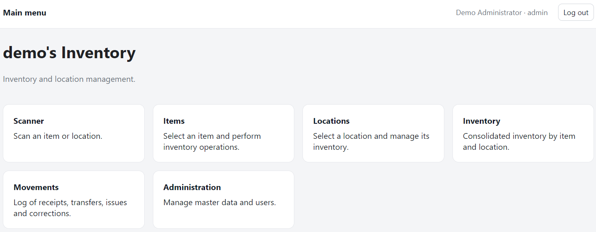
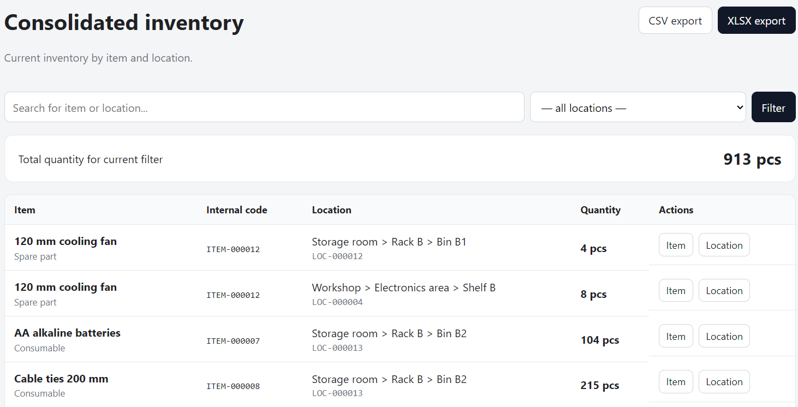
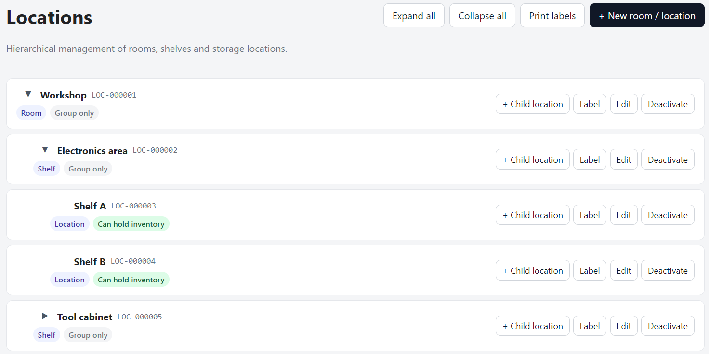
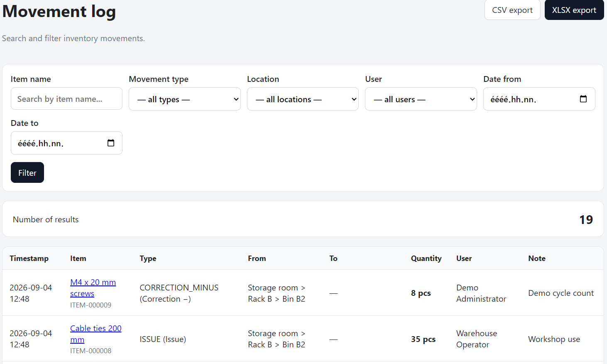

# Username's Inventory v0.1.0-alpha.1

This is the first public alpha release of **Username's Inventory**, a self-hosted inventory management application designed for small workshops, storage rooms, home labs, offices, and similar environments.

The application focuses on keeping physical items, stock quantities, storage locations, and inventory movements easy to manage from both desktop and mobile browsers.

## Highlights

- Hierarchical storage locations
- Item and item-type management
- Stock tracking by location
- Receipts, issues, transfers, and stock corrections
- Inventory movement history
- Barcode and identifier support
- Barcode scanner interface
- Printable item and location labels
- User accounts with role-based permissions
- Hungarian and English interface
- Responsive web UI
- PostgreSQL database
- Reproducible Ubuntu installation script
- systemd / Gunicorn deployment example
- Synthetic demo dataset for testing and screenshots

## Screenshots

### Dashboard

### Stock

### Locations

### Movements

## Installation

See:

- `docs/INSTALL.md`
- `docs/INSTALL_HU.md`

The included `install.sh` provides a reproducible installation path for a fresh Ubuntu system.

## Alpha status

This is an early public alpha release.

The application is already usable, but interfaces, database structures, installation details, and features may still change before a stable release.

Before using it with important data, regular database and upload backups are strongly recommended.

## License

MIT License.
